# Route Architecture, Static Page Inventory, and Route Graph

This document details the route hierarchy, static page inventory (39 pre-rendered build artifacts), design rationale for each page, and graph-mode connectivity across Hardware Collection.

---

## 1. Page Inventory Breakdown

### 1.1 Next.js App Router Source Templates
The source code defines 7 page routes, 1 custom error boundary, and 5 API routes:

| Route Pattern | Source Path | Type | Render Target |
| :--- | :--- | :--- | :--- |
| `/` | [`src/app/page.tsx`](file:///e:/Hardware-Collection/src/app/page.tsx) | Static (SSG) | Showroom Experience Landing |
| `/collections` | [`src/app/collections/page.tsx`](file:///e:/Hardware-Collection/src/app/collections/page.tsx) | Static (SSG) | Guided Discovery Hub |
| `/collections/[slug]` | [`src/app/collections/[slug]/page.tsx`](file:///e:/Hardware-Collection/src/app/collections/[slug]/page.tsx) | Dynamic (SSG via `generateStaticParams`) | Space Landing or Category Detail |
| `/catalogs` | [`src/app/catalogs/page.tsx`](file:///e:/Hardware-Collection/src/app/catalogs/page.tsx) | Static (SSG) | Brand Partner Catalogs & Specs |
| `/privacy` | [`src/app/privacy/page.tsx`](file:///e:/Hardware-Collection/src/app/privacy/page.tsx) | Static (SSG) | Privacy Policy |
| `/terms` | [`src/app/terms/page.tsx`](file:///e:/Hardware-Collection/src/app/terms/page.tsx) | Static (SSG) | Terms of Service |
| `/studio/[[...tool]]` | [`src/app/studio/[[...tool]]/page.tsx`](file:///e:/Hardware-Collection/src/app/studio/[[...tool]]/page.tsx) | Dynamic (Client/Admin) | Embedded Sanity Studio CMS |
| `/_not-found` | [`src/app/not-found.tsx`](file:///e:/Hardware-Collection/src/app/not-found.tsx) | Static (SSG) | Custom Editorial 404 Error State |

---

### 1.2 The 39 Static Pages Pre-Rendered at Build
During production build (`npm run build`), Next.js prerenders 39 static HTML / RSC endpoints:

1. **6 Top-Level Static Pages:**
   - `/`
   - `/collections`
   - `/catalogs`
   - `/privacy`
   - `/terms`
   - `/_not-found`

2. **24 Pre-rendered `/collections/[slug]` Pages:**
   Generated from union of [`src/content/fallback/spaces.ts`](file:///e:/Hardware-Collection/src/content/fallback/spaces.ts), [`src/content/fallback/catalog.ts`](file:///e:/Hardware-Collection/src/content/fallback/catalog.ts), and live Sanity CMS documents:
   - **6 Space Intent Landings:**
     - `/collections/entrance`
     - `/collections/kitchen`
     - `/collections/wardrobe`
     - `/collections/bathroom`
     - `/collections/living-interior`
     - `/collections/commercial`
   - **13 Fallback Architectural Categories:**
     - `/collections/digital-locks`
     - `/collections/mortise-door-locks`
     - `/collections/main-door-handles`
     - `/collections/cabinet-wardrobe-handles`
     - `/collections/modular-kitchen-hardware`
     - `/collections/kitchen-sinks-faucets`
     - `/collections/wardrobe-hardware-sliding`
     - `/collections/hinges-soft-close`
     - `/collections/drawer-channels`
     - `/collections/bathroom-accessories`
     - `/collections/glass-hardware`
     - `/collections/door-closers-stoppers`
     - `/collections/safes`
   - **5 Remote Sanity Dynamic Categories:**
     - `/collections/architectural`
     - `/collections/bath`
     - `/collections/cabinet-and-drawer-hardware`
     - `/collections/doors`
     - `/collections/smart`

3. **9 Metadata & System Endpoints:**
   - `/_global-error`
   - `/robots.txt`
   - `/sitemap.xml`
   - `/favicon.ico`
   - RSC payload manifests & route segments

---

## 2. Page Rationale & Business Purpose

| Page Route | Why It's Present | Business & Conversion Rationale |
| :--- | :--- | :--- |
| **`/` (Showroom Home)** | Primary entry point & brand authority | Showcases curated physical bays, 20+ authorized partner brands, verified client testimonials, and immediate WhatsApp consultation routing. |
| **`/collections` (Discovery Hub)** | Search & intent navigation | Replaces flat product dumping with guided exploration: space intent rails, search with keyword indexing, and showroom family groupings. |
| **`/collections/[space-slug]` (6 Spaces)** | Architectural intent alignment | Serves clients building or renovating a specific room (e.g., Kitchen or Entrance). Groups all relevant hardware categories into a cohesive view. |
| **`/collections/[category-slug]` (18 Categories)** | Deep technical product catalog | Provides item specifications, finish options, brand filters, and pre-composed WhatsApp inquiries tailored to specific hardware needs. |
| **`/catalogs`** | Brand legitimacy & specification library | Houses downloadable technical PDFs and specification catalogs for authorized partner brands (Dorset, Hafele, Godrej, Kich, Labacha). |
| **`/privacy` & `/terms`** | Legal & SEO compliance | Satisfies search engine guidelines, Google Business Profile standards, and provides transparent terms of service. |
| **`/studio`** | Zero-deployment CMS administration | Allows showroom personnel to update live inventory, add products, adjust brands, and modify bay descriptions without triggering code commits. |
| **`/_not-found`** | Defensive user retention | Traps dead links with branded editorial styling and provides 1-click return paths to active collections without jarring user experience. |

---

## 3. Parent-Child Route Hierarchy (Graph Mode)

```mermaid
graph TD
    classDef root fill:#1e1e24,stroke:#e5c487,stroke-width:2px,color:#fff;
    classDef hub fill:#282830,stroke:#c8a96e,stroke-width:1.5px,color:#fff;
    classDef space fill:#1b2d3b,stroke:#5ea5d4,stroke-width:1.5px,color:#fff;
    classDef category fill:#243324,stroke:#70c170,stroke-width:1.5px,color:#fff;
    classDef utility fill:#2b2626,stroke:#888,stroke-width:1px,color:#ddd;

    HOME["/ (Home Showroom)"]:::root

    %% Primary Hubs
    COLLECTIONS["/collections (Discovery Hub)"]:::hub
    CATALOGS["/catalogs (Brand Catalogs)"]:::hub
    PRIVACY["/privacy"]:::utility
    TERMS["/terms"]:::utility
    STUDIO["/studio (Sanity Studio CMS)"]:::utility
    NOT_FOUND["/_not-found (404 Error State)"]:::utility

    %% Home Connections
    HOME -->|Primary Nav / Hero CTA| COLLECTIONS
    HOME -->|Brand Trust Strip / Footer| CATALOGS
    HOME -->|Footer Links| PRIVACY
    HOME -->|Footer Links| TERMS
    HOME -.->|Staff Direct URL| STUDIO
    HOME -.->|Invalid Route Trigger| NOT_FOUND

    %% Spaces Subgraph
    subgraph SPACES [Space Intent Landings]
        SPACE_ENTRANCE["/collections/entrance"]:::space
        SPACE_KITCHEN["/collections/kitchen"]:::space
        SPACE_WARDROBE["/collections/wardrobe"]:::space
        SPACE_BATH["/collections/bathroom"]:::space
        SPACE_LIVING["/collections/living-interior"]:::space
        SPACE_COMMERCIAL["/collections/commercial"]:::space
    end

    COLLECTIONS -->|Space Intent Rail| SPACE_ENTRANCE
    COLLECTIONS -->|Space Intent Rail| SPACE_KITCHEN
    COLLECTIONS -->|Space Intent Rail| SPACE_WARDROBE

    HOME -->|Space Feature Rail| SPACE_ENTRANCE
    HOME -->|Space Feature Rail| SPACE_KITCHEN

    %% Categories Subgraph
    subgraph CATEGORIES [Technical Category Landings]
        CAT_DIGITAL["/collections/digital-locks"]:::category
        CAT_MORTISE["/collections/mortise-door-locks"]:::category
        CAT_HANDLES["/collections/main-door-handles"]:::category
        CAT_CABINET["/collections/cabinet-wardrobe-handles"]:::category
        CAT_MODULAR["/collections/modular-kitchen-hardware"]:::category
        CAT_SINKS["/collections/kitchen-sinks-faucets"]:::category
        CAT_WARDROBE_SLIDE["/collections/wardrobe-hardware-sliding"]:::category
        CAT_HINGES["/collections/hinges-soft-close"]:::category
        CAT_CHANNELS["/collections/drawer-channels"]:::category
        CAT_BATH_ACC["/collections/bathroom-accessories"]:::category
        CAT_GLASS["/collections/glass-hardware"]:::category
        CAT_CLOSERS["/collections/door-closers-stoppers"]:::category
        CAT_SAFES["/collections/safes"]:::category
    end

    COLLECTIONS -->|Direct Category Grid| CAT_DIGITAL
    COLLECTIONS -->|Direct Category Grid| CAT_MODULAR
    COLLECTIONS -->|Direct Category Grid| CAT_HANDLES

    %% Space to Category Curated Interconnections
    SPACE_ENTRANCE -->|Linked Categories| CAT_HANDLES
    SPACE_ENTRANCE -->|Linked Categories| CAT_DIGITAL
    SPACE_ENTRANCE -->|Linked Categories| CAT_MORTISE
    SPACE_ENTRANCE -->|Linked Categories| CAT_CLOSERS

    SPACE_KITCHEN -->|Linked Categories| CAT_MODULAR
    SPACE_KITCHEN -->|Linked Categories| CAT_SINKS
    SPACE_KITCHEN -->|Linked Categories| CAT_HINGES
    SPACE_KITCHEN -->|Linked Categories| CAT_CHANNELS

    SPACE_WARDROBE -->|Linked Categories| CAT_WARDROBE_SLIDE
    SPACE_WARDROBE -->|Linked Categories| CAT_CABINET
    SPACE_WARDROBE -->|Linked Categories| CAT_HINGES
    SPACE_WARDROBE -->|Linked Categories| CAT_CHANNELS

    SPACE_BATH -->|Linked Categories| CAT_BATH_ACC
    SPACE_BATH -->|Linked Categories| CAT_GLASS

    SPACE_LIVING -->|Linked Categories| CAT_CABINET
    SPACE_LIVING -->|Linked Categories| CAT_CHANNELS
    SPACE_LIVING -->|Linked Categories| CAT_SAFES

    SPACE_COMMERCIAL -->|Linked Categories| CAT_CLOSERS
    SPACE_COMMERCIAL -->|Linked Categories| CAT_GLASS
    SPACE_COMMERCIAL -->|Linked Categories| CAT_SAFES

    %% Cross-Hub Interconnections
    CAT_DIGITAL -->|Brand Chip Click| CATALOGS
    CAT_MODULAR -->|Brand Chip Click| CATALOGS
    CATALOGS -->|Category Filter Click| COLLECTIONS
    NOT_FOUND -->|Recovery Button| COLLECTIONS
```



---

## 4. Single-Segment Dynamic Route Resolution

Dynamic collection routing is governed by [`src/lib/collections/routing.ts`](file:///e:/Hardware-Collection/src/lib/collections/routing.ts) inside [`src/app/collections/[slug]/page.tsx`](file:///e:/Hardware-Collection/src/app/collections/[slug]/page.tsx):

```text
Request: /collections/:slug
       │
       ▼
┌───────────────────────────┐
│ resolveCollectionSlug(slug)│
└─────────────┬─────────────┘
              │
       ┌──────┴──────────────────────┐
       │                             │
       ▼                             ▼
Does slug match a Space?      Does slug match a Category?
(e.g., "kitchen")              (e.g., "digital-locks")
       │                             │
       ▼                             ▼
Render SpaceLandingClient     Render CategoryDetailClient
(Aggregates linked categories) (Shows specs, brand chips, WhatsApp CTA)
       │                             │
       └──────────────┬──────────────┘
                      │
              If neither matches
                      │
                      ▼
               Trigger notFound()
               (Renders _not-found.tsx)
```

1. **Resolution Precedence:** Space matching takes priority over category matching.
2. **Single-Segment Clean URLs:** Both spaces and categories reside under `/collections/[slug]`, preventing messy multi-segment nesting while keeping SEO authority unified.
3. **Resilience Architecture:** If Sanity CMS is unreachable, routing falls back smoothly to [`src/content/fallback/catalog.ts`](file:///e:/Hardware-Collection/src/content/fallback/catalog.ts) and [`src/content/fallback/spaces.ts`](file:///e:/Hardware-Collection/src/content/fallback/spaces.ts) with zero build or runtime breakage.
