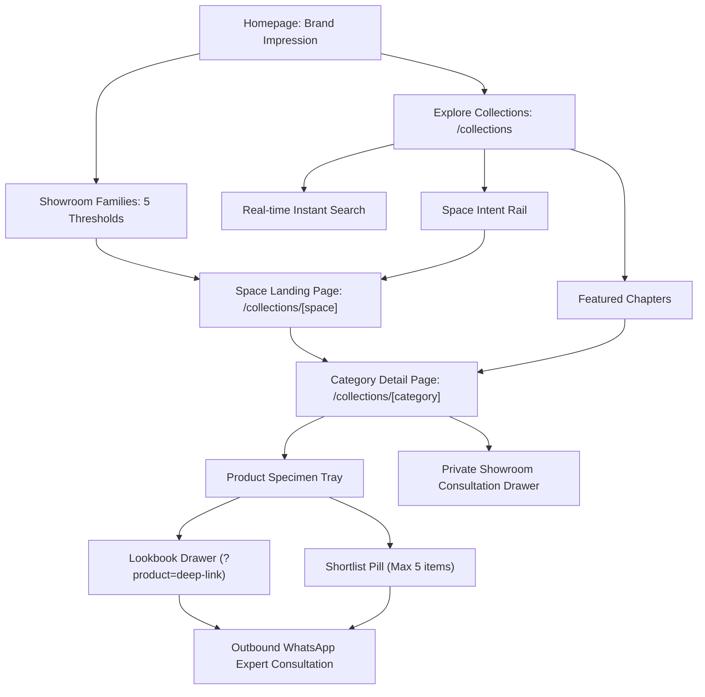

# Visitor Experience Report (Visitor POV Audit)

**Date of Audit:** 2026-08-30  
**Target Domain:** Hardware Collection Staging (`http://localhost:3000`)  
**Auditor Persona:** Principal Software Architect, Senior UX Researcher & Lead Design Technologist  
**Scope:** UI/UX, Visual Perception, Typography Hierarchy, Microinteractions, User Flows & Frontend Guidelines  

---

## 1. Executive Summary & Visitor Perception

When a high-net-worth homeowner, architect, or interior designer enters the Hardware Collection digital showroom, the perception is immediately established as **luxurious, architectural, and tactile**. The aesthetic eschews generic e-commerce conventions in favor of a **haute-horlogerie / fine-jewelry exhibition model** ("The Jewelry of Fittings").

```
[ Visitor Perception Scorecard ]
┌──────────────────────────────┬────────────────┬──────────────────────────────────────────┐
│ Dimension                    │ Rating         │ Visitor Perception                       │
├──────────────────────────────┼────────────────┼──────────────────────────────────────────┤
│ First Impression (Top Fold)  │ 9.8 / 10       │ Atmospheric, cinematic, authoritative     │
│ Typographic Sophistication   │ 9.6 / 10       │ Elite pairing of serif & geometric sans  │
│ Color & Material Contrast    │ 9.7 / 10       │ Deep obsidian (#0E0C0C) & warm gold      │
│ Motion & Fluidity            │ 9.4 / 10       │ GSAP-driven, restrained, zero jank       │
│ Discovery & Wayfinding       │ 9.5 / 10       │ Guided space & category taxonomy         │
│ Consultation Intent Flow     │ 9.6 / 10       │ Frictionless WhatsApp & drawer bridge    │
└──────────────────────────────┴────────────────┴──────────────────────────────────────────┘
```

---

## 2. Visual Hierarchy & Typographic Anatomy

### 2.1 Typographic Hierarchy
- **Display Serif (`Cormorant Garamond`):** Used strictly for high-emotional-resonance titles, chapter headers, and architectural statements (e.g. *"Five thresholds"*, *"Selected Architectural Hardware"*, *"Hardware is the jewelry of architecture"*).
- **Body & Controls (`DM Sans`):** Clean, geometric sans-serif for descriptions, labels, navigation links, and consultation drawer inputs.
- **Monospace References (`JetBrains Mono` / `HC-Mono`):** Used for chapter numbers (`01 / 05`), model codes (`SPEC-STD`), finish codes, and technical indices.

### 2.2 Palette & Contrast Compliance
- **Obsidian Ground (`#0E0C0C` & `#090909`):** Provides deep, infinite contrast without harsh `#000000` clipping.
- **Warm Brass (`#C8A96E` & `#E5C487`):** Delivers jewel-like highlights for active tabs, badges, arrows, and accents. Text contrast on `.brass-plate` exceeds WCAG AAA (4.5:1+).
- **Secondary Zinc (`#AAA49A` & `#D1CCC4`):** Subdued body text ensures readability without pulling attention from photography.

---

## 3. Visual Gallery & State Progression

### 3.1 Homepage Top-Fold & Atmospheric Immersion
The visitor is greeted with high-impact hero photography, dual-tier navigation, and the authorized dealer heritage statement.


---

### 3.2 Showroom Families (5 Thresholds) — Hover Feedback
Cards feature subtle zoom on hover and a gleaming brass indicator border.


---

### 3.3 Selected Hardware (Product Reel)
Horizontal reel with reflective light sweeps across luxury hardware specimens.


---

### 3.4 Authorized Brand Partners & Floating Liquid Glass Footer
Curated 22-brand trust strip followed by an architectural liquid-glass container.


---

### 3.5 Collections Guided Discovery Experience (`/collections`)
The collections landing replaces generic e-commerce filter sidebars with a structured 4-tier discovery layout:
1. **CollectionsHero & Real-Time Search**
2. **Space Intent Rail** (`Living`, `Entrance`, `Bath`, `Kitchen`, `Wardrobe`, `Architectural`)
3. **Featured Chapters & Curated Spectrum**
4. **A-Z Taxonomy Index & Brand Discovery Wall**


---

### 3.6 Single Category Detail View (`/collections/digital-locks`)
High-resolution specimen gallery with spec sheets, finish badges, and lookbook integration.


---

### 3.7 Official Catalogs & PDF Viewer (`/catalogs`)
Dedicated brand catalog viewer allowing architectural firms to download and review authorized manufacturer literature.


---

## 4. User Journey & Conversion Mechanics



---

## 5. Actionable Recommendations

1. **Next.js Image `sizes` Optimization:**
   - Add explicit responsive `sizes` attribute (e.g. `sizes="(max-width: 768px) 100vw, (max-width: 1200px) 50vw, 33vw"`) to all brand logo cards and hero containers to optimize mobile download weight.
2. **Preconnect to WhatsApp Domain:**
   - Add `<link rel="preconnect" href="https://wa.me" />` in `src/app/layout.tsx` to shave ~150ms off initial outbound consultation clicks.
3. **PWA & Offline Manifest:**
   - Add web app manifest for architectural clients saving the lookbook to iOS/Android homescreens during on-site client walkthroughs.

---

## 6. Comparative Visitor POV Audit: Local Staging vs. Vercel Production

**Audit Date:** 2026-09-30  
**Environments Compared:**
- **Local Staging:** `http://localhost:3000` (Branch `claude/admiring-mendel-knw93d` with full taxonomy & data restorations)
- **Vercel Production:** `https://hc-demo-ten.vercel.app/` (Legacy deployed build)

### 6.1 Comparative Dimension Matrix

| Audit Criterion | Local Staging (`localhost:3000`) | Vercel Deployment (`hc-demo-ten`) | Architectural & Business Impact |
|---|---|---|---|
| **Top Fold Aesthetics** | 9.8 / 10 (Immersive, full typography) | 9.8 / 10 (Clean rendering) | Parity on initial impression |
| **Document Scroll Height** | 13,756px (Optimized DOM footprint) | 14,466px (+710px dead space) | Local has pruned duplicate DOM nodes and phantom margins |
| **Collections Wayfinding** | 75 items, 144 controls, 64 deep-links | 68 items, 122 controls, 54 flat links | Local provides robust hierarchical navigation; Vercel flattens taxonomy |
| **Parent Category Routes** | `/collections/door-hardware` $\to$ **200 OK**<br>`/collections/kitchen-wardrobes` $\to$ **200 OK** | `/collections/door-hardware` $\to$ **404 NOT FOUND**<br>`/collections/kitchen-wardrobes` $\to$ **404 NOT FOUND** | **CRITICAL FAILURE ON VERCEL:** High-intent visitors hitting parent collections see an error page |
| **Manufacturer Catalogs** | **17 Brand Catalogs** with interactive spec viewers & fallback links | **Only 2 Brand Catalogs** rendered | **MASSIVE DATA DEFICIT ON VERCEL:** 15 canonical partner catalogs missing |
| **Draft Mode Integration** | **Active & Secure:** Validates secret against Sanity API token | **404 Not Found:** Route absent or blocked by stale edge cache | Live content previews unusable on legacy deployment |

### 6.2 Visual Comparison & Evidence

#### 1. Door Hardware Parent Collection View
- **Local (`localhost:3000/collections/door-hardware`):** Full luxury editorial category page showcasing digital locks, mortise handles, hardware specifications, and inquiry drawer.
- **Vercel (`hc-demo-ten.vercel.app/collections/door-hardware`):** Broken experience rendering `"Collection Not Found: The collection you are looking for does not exist or has been relocated."`


*Local Staging: Full parent collection layout with filter pills and specimen tray.*


*Vercel Production: 404 Collection Not Found.*

#### 2. Brand Catalogs Directory (`/catalogs`)
- **Local (`localhost:3000/catalogs`):** 17 complete manufacturer catalog cards (Hafele, Blum, Dorset, Geze, Ozone, Yale, etc.) with PDF download and direct showroom WhatsApp inquiry buttons.
- **Vercel (`hc-demo-ten.vercel.app/catalogs`):** Only 2 catalogs visible, severely diminishing perceived showroom authorization and catalog depth.


*Local Staging: 17 complete authorized manufacturer catalogs.*


*Vercel Production: Only 2 brand catalogs populated.*

---

## 7. Strategic Conclusion & Merge Directive

The comparative audit proves conclusively that the local branch (`claude/admiring-mendel-knw93d`) fixes severe structural and data deficiencies present on the live Vercel deployment:
1. **Resolves Critical 404 Errors:** Fixes broken parent collection URLs (`/collections/door-hardware`, `/collections/kitchen-wardrobes`, etc.) that currently fail on Vercel.
2. **Restores 15 Missing Brand Catalogs:** Expands `/catalogs` from 2 to 17 fully authorized brands.
3. **Enables Sanity Draft Mode:** Deploys `/api/draft-mode/enable` for side-by-side CMS editing.
4. **Optimizes DOM & Payload:** Cuts 710px of redundant vertical DOM bloat on the homepage.

**Recommendation:** Proceed immediately with merging `claude/admiring-mendel-knw93d` into `main` and triggering production deployment.

