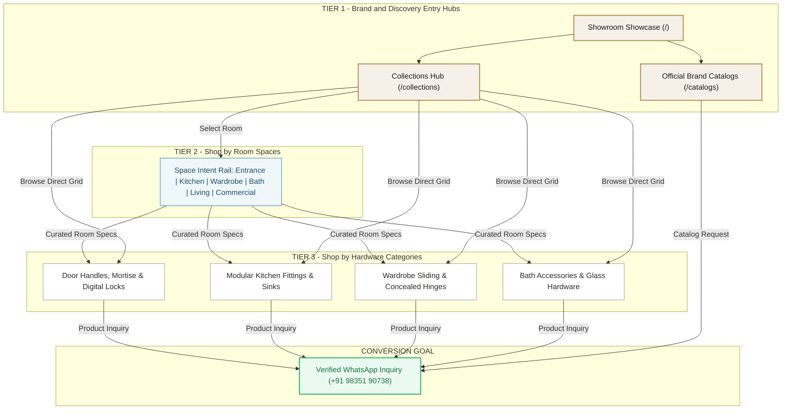

# Hardware Collection — Route Architecture & Client Use Case Blueprint

> **A4 Printable Visual Reference:** Open [`docs/CLIENT_PAGE_ARCHITECTURE_A4.html`](file:///e:/Hardware-Collection/docs/CLIENT_PAGE_ARCHITECTURE_A4.html) in your browser and press `Ctrl + P` to print or save as a single-page A4 PDF.

---

## 1. The 3-Tier Customer Journey (How Pages Connect)

---

## 2. Client Use Case & Business Value Matrix

| Page Route | Who It's For | What They Do Here | Business Value |
| :--- | :--- | :--- | :--- |
| **`/`** (Showroom Home) | **Homeowners & Architects** | Explore physical showroom bays, verify authorized dealer status (20+ brands), check store location, and request consultation. | Builds trust, proves authorized status, and drives showroom visits. |
| **`/collections`** (Guided Discovery) | **First-Time Visitors & Renovators** | Search across all hardware by keyword or select a room to furnish. | Eliminates clutter by organizing 100+ items into intuitive room choices. |
| **`/collections/[space]`** (6 Space Landings) | **Room Renovators & Interior Designers** | Browse all hardware needed for an entire room in one place (e.g. Kitchen = Sinks + Soft-close + Runners). | Increases project size and basket value through bundled hardware discovery. |
| **`/collections/[category]`** (18 Category Pages) | **Contractors & Specifiers** | Filter products by brand (Dorset, Hafele, Godrej), check finishes, and submit technical inquiries. | Generates qualified sales leads pre-tagged with the exact item of interest. |
| **`/catalogs`** (Brand Catalogs) | **Architects & Fabricators** | Download official PDF catalogs and architectural specification sheets. | Validates authorized dealership and equips specifiers with dimension sheets. |
| **`/studio`** (Sanity Studio CMS) | **Showroom Staff** | Add new arrivals, adjust photos, and update brand details without writing code. | Enables non-technical showroom managers to update inventory instantly. |
| **`/_not-found`** (404 Error Handler) | **Any User** | Guides lost visitors back to active collections or offers a 1-click WhatsApp helpline. | Ensures zero dead-ends and prevents lost inquiries. |

---

## 3. How to Print or Present to Clients
1. Open the companion file [`docs/CLIENT_PAGE_ARCHITECTURE_A4.html`](file:///e:/Hardware-Collection/docs/CLIENT_PAGE_ARCHITECTURE_A4.html) in Chrome or Edge.
2. Click the top-right button **"Print / Save as PDF (A4)"** (or press `Ctrl + P`).
3. Set **Destination** to `Save as PDF` and **Layout** to `Portrait`.
4. The document is pre-formatted with margins, clean gold styling, and balanced whitespace to fit on an A4 sheet.
